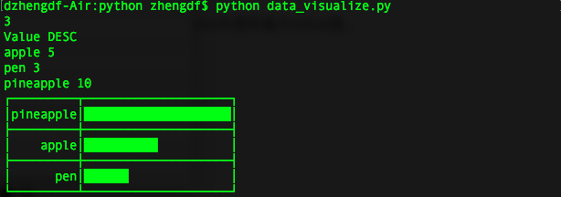

# 数据可视化

### 题目

**输入**
第一行，一个整数N（1<=n<=20），表示这组数据的条目数。
第二行，两个字符串，用于表示数据展示在柱状图上的排序方式。第一个字符串是“Name”或者“Value”，表示排序的依据是数据条目的名称亦或数值；第二个字符串是”ASC”或者”DESC”，表示升序或降序。
随后的N行，每行包含一个字符串S和一个数字V，以空格分隔，表示一条数据。S即数据条目的名称，仅包含小写字母，V即对应的数值，是一个整数，(0<=V<=1,000,000)

**输出**
若干行，由字符拼成的柱状图。图中可能用到的字符如下：
“┌”（\u250c），“┐”（\u2510），“└”（\u2514），“┘”（\u2518）：图表外框转角符号
“─”（\u2500），“│”（\u2502）：图表中的横、竖线
“├”（\u251c），“┤”（\u2524），“┬”（\u252c），“┴”（\u2534），“┼”（\u253c）：图表中的各种交叉线
“█”（\u2588）：用来拼柱子的字符
“ ”（\u0020）：图表中的空格
图表中名称区域的宽度，由这组数据中名称的最大长度决定，所有名称向右对齐， 图表中柱的最大长度为20，每个柱的长度由该柱对应数据和这组数据中最大值（此值一定大于0）的比值与20相乘获得，不足一格的部分舍去。

### 解决方案

**编程语言**：Python

**主要步骤**：

1.输入数据总数。

```python
import sys
while(True):
    count = int(sys.stdin.readline().strip('\n'))
    if count < 1 or count > 20:
        print("Error input, expect a integer N (1<=N<=20).\nPlease input again!")
    else:
        break
```

2.输入排序规则。

```python
import sys
while(True):
    sort_options = sys.stdin.readline().split()
    if len(sort_options) != 2 or ("Value" not in sort_options and "Name" not in sort_options) \
       or ("ASC" not in sort_options and "DESC" not in sort_options):
        print("Error input, expect: Value/Name DESC/ASC!\nPlease input again!")
    else:
        break
```

3.输入数据内容。

```python
import sys
contains = {}
for i in range(count):
    while(True):
        temp_input = sys.stdin.readline().split()
        if len(temp_input) != 2:
            print("input error, expect : name value!\nPlease input again!")
        else:
            break
    contains[temp_input[0]] = int(temp_input[1])
```

4.根据排序规则对数据排序。

```python
def sort_diction(diction, option):
    items = []
    if option == "Value":# sort by value
        items = sorted(diction.items(), key=lambda d: d[1])
    else:                # sort by name
        items = sorted(diction.items(), key=lambda d: d[0])
    return items
```

5.计算数据中最长Name长度和最大Value值。

```python
class Data_Info:
    _max_value = ""
    _max_len   = ""
    def __init__(self, max_value, max_len):
        self._max_value, self._max_len = max_value, max_len
        
def get_data_info(diction):
    # max value
    max_value = diction[max(diction, key=lambda x: diction[x])]
    # longest name's length
    max_len = len(max(diction, key=lambda x: len(x)))
    return Data_Info(max_value, max_len)
```

6.打印表格内容。

```python
def show(items, option, info):
    row = len(items) * 2 + 1
    idx = 0
    for i in range(row):
        if i == 0:
            line = '\u250c' + '\u2500' * info._max_len + '\u252c' + '\u2500' * 20 + '\u2510'
            print(line.decode('unicode_escape'))
        elif i == row - 1:
            line = '\u2514' + '\u2500' * info._max_len + '\u2534' + '\u2500' * 20 + '\u2518'
            print(line.decode('unicode_escape'))
        elif i % 2 == 0:
            line = '\u251c' + '\u2500' * info._max_len + '\u253c' + '\u2500' * 20 + '\u2524'
            print(line.decode('unicode_escape'))                
        else:
            if option == "ASC":  # ascend order
                length = int(float(items[idx][1]) / info._max_value * 20.0)
                line = '\u2502' + '\u0020' * (info._max_len - len(items[idx][0])) + items[idx][0] + \
                       '\u2502' + '\u2588' * length + '\u0020' * (20 - length) + '\u2502'
                idx += 1
                print(line.decode('unicode_escape'))
            else:                # descend order
                length = int(float(items[-1-idx][1]) / info._max_value * 20.0)
                line = '\u2502' + '\u0020' * (info._max_len - len(items[-1 - idx][0])) + items[-1 - idx][0] + \
                       '\u2502' + '\u2588' * length + '\u0020' * (20 - length) + '\u2502'
                idx += 1
                print(line.decode('unicode_escape'))
```

**测试结果**：



